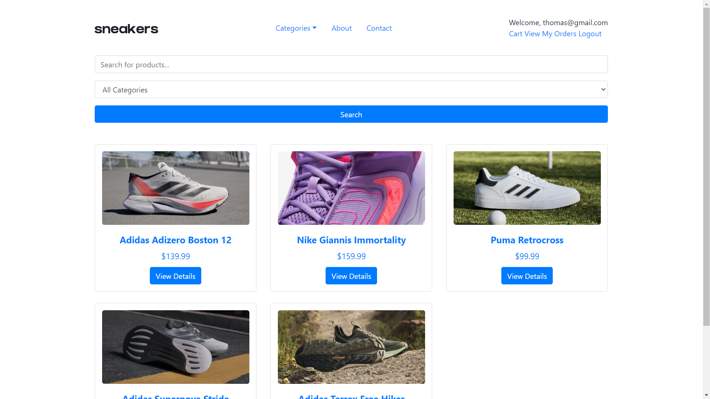
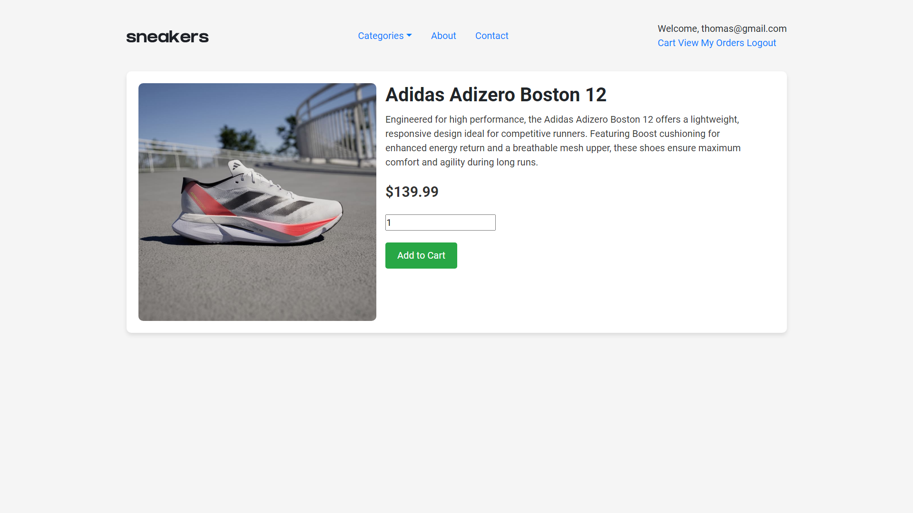
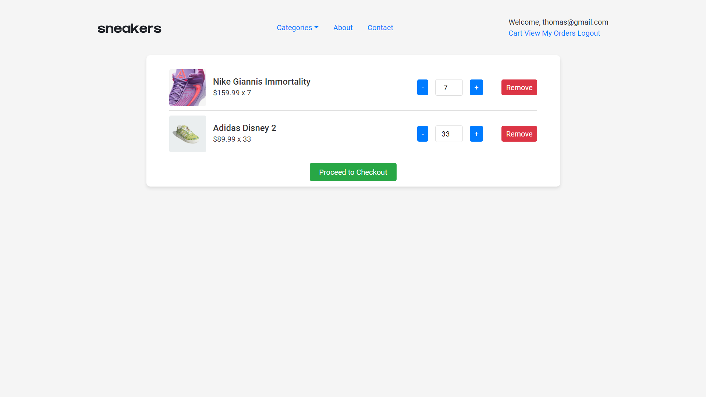
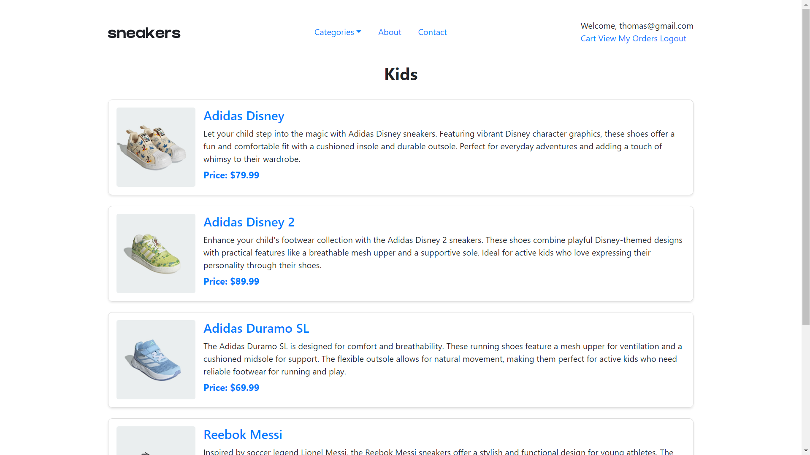
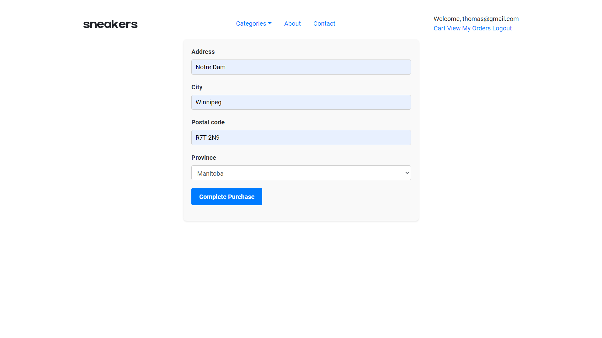
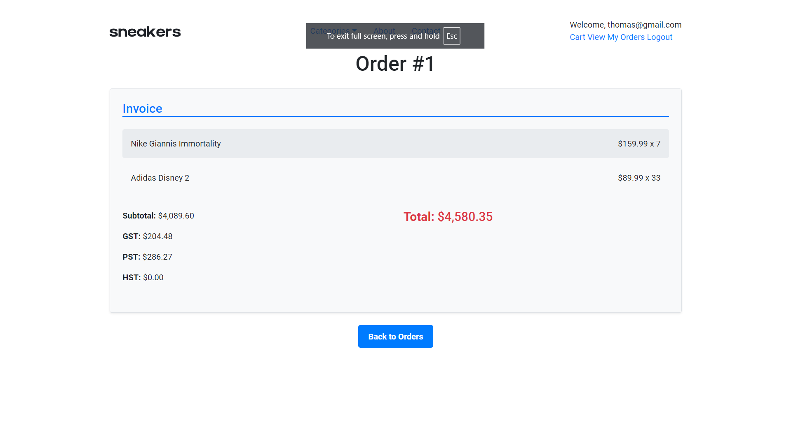

# Sneakers E-commerce Store 🛒👟

Welcome to **Sneakers**, a full-stack e-commerce web application built using Ruby on Rails, designed for selling shoes for men, women, kids, and sports categories.

---

## Table of Contents
- [About the Project](#about-the-project)
- [Features](#features)
- [Tech Stack](#tech-stack)
- [Screenshots](#screenshots)
- [Usage](#usage)
- [License](#license)
- [Contact](#contact)

---

## About the Project
**Sneakers** is an e-commerce application that allows users to browse and purchase shoes from various categories. The project implements key e-commerce features, including user authentication, a shopping cart, product management via an admin dashboard, and payment integration with Stripe.

---

## Features
- **User Authentication**: Signup, login, and profile management.
- **Admin Dashboard**: Manage products and categories, add/edit products.
- **Shopping Cart**: Add items to the cart, view cart, adjust quantities.
- **Checkout**: Process transactions with Stripe, including real-time tax calculations based on province.
- **Search Functionality**: Allows users to search for products normally and also by category.
- **Responsive Design**: Mobile-friendly layout.

---

## Tech Stack
- **Backend**: Ruby on Rails
- **Frontend**: Bootstrap 5
- **Payment Processing**: Stripe API
- **Database**: Sqlite3
- **Version Control**: Git & GitHub

---

## Screenshots

### Home Page

### Product Page

### Shopping Cart

### Category Products

### Payment Page

### Invoice Page

## Usage

- Visit \`http://localhost:3000\` to view the website.
- Signup, login, and explore the features.
- Search products by category.
- Admin can access the dashboard to manage products.

---

## License
Distributed under the MIT License. See `LICENSE` for more information.

---

## Contact
**Hemal Varsani**  
GitHub: [https://github.com/varsanihemal](https://github.com/varsanihemal)

-
